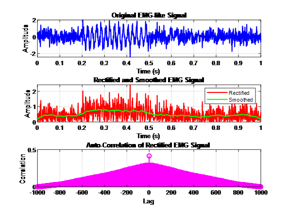

# EMG Signal Processing: Neuromuscular Analysis System

> **A Biomedical Engineering project focused on digital signal processing (DSP) for muscle activation analysis and fatigue detection.**

##  Project Overview
Developed during the 5th semester at Sir Syed University of Engineering and Technology (SSUET), this repository contains a complete pipeline for processing Electromyography (EMG) signals. The project demonstrates the transition from raw, noisy bio-data to interpreted physiological information using MATLAB-based digital filters and statistical analysis.

This work serves as a technical foundation for applications in **Medical Diagnostics**, **Myoelectric Prosthetic Control**, and **Rehabilitation Biofeedback**.

## Individual Contributions
To demonstrate effective project management and collaboration, the roles were divided as follows:

* **Shahmeer Hussain [@shahmeeerx](https://github.com/shahmeeerx):** Designed the digital processing pipeline, implemented the 50-tap Moving Average Filter, and authored the comprehensive technical report for academic submission.
* **Amna Yousuf [@amna-014](https://github.com/amna-014):** Developed the synthetic signal generation protocols ($1000\text{ Hz}$ sampling) and led the auto-correlation analysis for periodicity detection.

##  Technical Methodology
The processing pipeline implements the following engineering standards:

* **Signal Generation:** Synthetic generation combining Random Gaussian Noise with a $50\text{ Hz}$ Sine Wave burst to replicate stochastic muscle activity.
* **Sampling Architecture:** Configured with a sampling frequency ($Fs$) of $1000\text{ Hz}$ for high-fidelity temporal resolution.
* **Rectification & Smoothing:** Full-wave rectification followed by a **50-sample Moving Average Filter** to isolate meaningful activation trends.
* **Periodicity Analysis:** Biased Auto-Correlation used to identify dominant frequencies and detect spectral shifts related to muscle fatigue.

## Results & Visualization
The image below illustrates the efficacy of the filtering pipeline in extracting muscle bursts from background environmental interference.

*Figure 1: Comparison of Original (Noisy), Rectified, and Smoothed signals with Auto-Correlation analysis.*

## Repository Contents
* **`EMG_Signal_Analysis.m`**: Core MATLAB source code.
* **`Project_Report.pdf`**: Detailed technical documentation and academic analysis.
* **`EMG_Processing_Results_Waveforms.png`**: Result plots.
* **`LICENSE`**: MIT License for open-source transparency.

## Development Team
* **Shahmeer Hussain** — [@shahmeeerx](https://github.com/shahmeeerx) (2022F-BBM-014)
* **Amna Yousuf** — [@amna-014](https://github.com/amna-014) (2022F-BBM-012)

---
_© 2025 EMG Processing Project. Built for the Dept. of Biomedical Engineering, SSUET._
